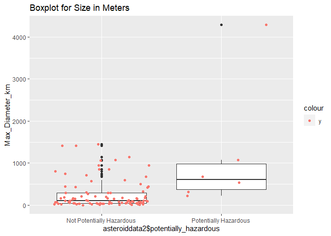
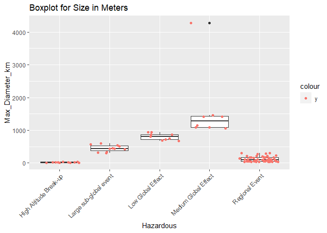
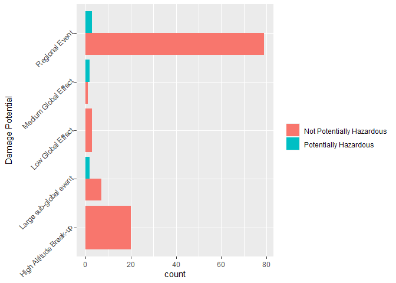
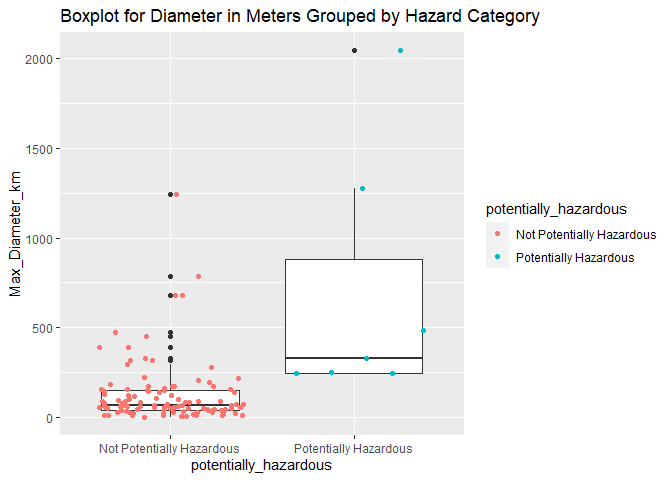
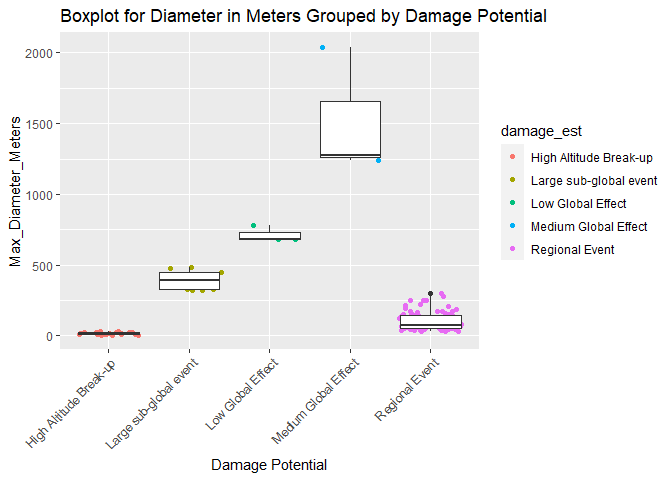

NASA Near Earth Orbit Asteroid Analysis API
================
Dave Bergeron
9/30/2021

# Requirements

List of functions used with NASA API, I used the following packages:

-   `tidyverse`: tons of useful features for data manipulation and
    visualization
-   `jsonlite`: API interaction

In addition to those packages, I used the following packages in the rest
of the document:

-   `cowplot`: extra functionality for `ggplot2`  
-   `imager`: loading in images  
-   `broom`: tidying up a regression output for display
-   `knitr`: displaying tables in a markdown friendly way

# Functions to contact API and inspect data

xxxx

``` r
#date format: yyyy-mm-dd
#asteroidcall <- function(start_date,end_date,...){asteroid = GET("https://api.nasa.gov/neo/rest/v1/feed?start_date=", start_date, "&end_date=", end_date, "&api_key=A32PWecdgC6LNUv1gxmGtZYL1z9adqrOF276W7w9")
#str(asteroid, max.level = 1)}
#asteroidcall("2021-09-27", "2021-10-02")
```

``` r
asteroid = GET("https://api.nasa.gov/neo/rest/v1/feed?start_date=2021-09-025&end_date=2021-10-02&api_key=A32PWecdgC6LNUv1gxmGtZYL1z9adqrOF276W7w9")
str(asteroid, max.level = 1)
```

    ## List of 10
    ##  $ url        : chr "https://api.nasa.gov/neo/rest/v1/feed?start_date=2021-09-025&end_date=2021-10-02&api_key=A32PWecdgC6LNUv1gxmGtZ"| __truncated__
    ##  $ status_code: int 200
    ##  $ headers    :List of 18
    ##   ..- attr(*, "class")= chr [1:2] "insensitive" "list"
    ##  $ all_headers:List of 1
    ##  $ cookies    :'data.frame': 0 obs. of  7 variables:
    ##  $ content    : raw [1:115917] 7b 22 6c 69 ...
    ##  $ date       : POSIXct[1:1], format:  ...
    ##  $ times      : Named num [1:6] 0 0.000068 0.00007 0.000167 0.075269 ...
    ##   ..- attr(*, "names")= chr [1:6] "redirect" "namelookup" "connect" "pretransfer" ...
    ##  $ request    :List of 7
    ##   ..- attr(*, "class")= chr "request"
    ##  $ handle     :Class 'curl_handle' <externalptr> 
    ##  - attr(*, "class")= chr "response"

``` r
asteroidcloseapproach = GET("https://ssd-api.jpl.nasa.gov/sentry.api?removed=1")
str(asteroidcloseapproach, max.level = 1)
```

    ## List of 10
    ##  $ url        : chr "https://ssd-api.jpl.nasa.gov/sentry.api?removed=1"
    ##  $ status_code: int 200
    ##  $ headers    :List of 6
    ##   ..- attr(*, "class")= chr [1:2] "insensitive" "list"
    ##  $ all_headers:List of 1
    ##  $ cookies    :'data.frame': 0 obs. of  7 variables:
    ##  $ content    : raw [1:145935] 7b 22 63 6f ...
    ##  $ date       : POSIXct[1:1], format:  ...
    ##  $ times      : Named num [1:6] 0 0.000037 0.000038 0.000087 0.152078 ...
    ##   ..- attr(*, "names")= chr [1:6] "redirect" "namelookup" "connect" "pretransfer" ...
    ##  $ request    :List of 7
    ##   ..- attr(*, "class")= chr "request"
    ##  $ handle     :Class 'curl_handle' <externalptr> 
    ##  - attr(*, "class")= chr "response"

# Converting data in the API Call

Taking the asteroid data and compiling it into one dataframe/tibble. API
call retuns one dataframe per date, need to combine into one tibble.,
adding date column and removing neo\_ID, url, and list. Adding date of
observation column

``` r
asteroiddata = fromJSON(rawToChar(asteroid$content), flatten = TRUE)
asteroiddata2 <- do.call("rbind", asteroiddata$near_earth_objects)
asteroiddata2 <- subset(asteroiddata2, select = -c(neo_reference_id, links.self, close_approach_data))
asteroiddata2 <- add_column(asteroiddata2, asteroid$date)
asteroiddata2 <- asteroiddata2[ ,c(15,1,2,5,4,6,7,8,9,10,11,12,13,14,3)]
#need to get date/time of observations
```

2nd endpoint pull from asteroid set

``` r
removedsentry = fromJSON(rawToChar(asteroidcloseapproach$content), flatten = TRUE)
removedsentry
```

    ## $count
    ## [1] "2836"
    ## 
    ## $signature
    ## $signature$source
    ## [1] "NASA/JPL Sentry Data API"
    ## 
    ## $signature$version
    ## [1] "2.0"
    ## 
    ## 
    ## $data
    ##                 removed
    ## 1   2021-09-30 13:50:36
    ## 2   2021-09-22 17:31:55
    ## 3   2021-09-18 14:09:22
    ## 4   2021-09-17 19:16:26
    ## 5   2021-09-15 13:20:48
    ## 6   2021-09-13 15:39:45
    ## 7   2021-09-07 14:59:24
    ## 8   2021-09-07 14:34:43
    ## 9   2021-09-06 14:12:15
    ## 10  2021-09-04 13:45:31
    ## 11  2021-09-03 14:06:24
    ## 12  2021-08-30 13:59:08
    ## 13  2021-08-28 13:26:16
    ## 14  2021-08-28 13:22:45
    ## 15  2021-08-27 13:30:10
    ## 16  2021-08-19 18:22:52
    ## 17  2021-08-19 18:21:13
    ## 18  2021-08-17 13:46:43
    ## 19  2021-08-15 20:11:58
    ## 20  2021-08-15 18:40:29
    ## 21  2021-08-15 18:38:01
    ## 22  2021-08-15 17:05:10
    ## 23  2021-08-15 16:29:44
    ## 24  2021-08-15 11:39:28
    ## 25  2021-08-15 11:30:45
    ## 26  2021-08-15 11:30:00
    ## 27  2021-08-15 11:07:49
    ## 28  2021-08-15 11:06:23
    ## 29  2021-08-15 10:59:58
    ## 30  2021-08-15 10:31:21
    ## 31  2021-08-15 10:30:31
    ## 32  2021-08-15 10:29:05
    ## 33  2021-08-15 10:26:22
    ## 34  2021-08-15 10:01:09
    ## 35  2021-08-12 16:47:47
    ## 36  2021-08-11 22:28:30
    ## 37  2021-08-10 16:32:35
    ## 38  2021-08-09 16:58:35
    ## 39  2021-08-09 16:57:46
    ## 40  2021-08-09 16:57:02
    ## 41  2021-08-09 16:54:44
    ## 42  2021-08-09 16:53:57
    ## 43  2021-08-09 16:47:35
    ## 44  2021-08-09 16:46:51
    ## 45  2021-08-09 16:44:53
    ## 46  2021-08-09 16:39:42
    ## 47  2021-08-05 22:31:01
    ## 48  2021-08-05 15:30:46
    ## 49  2021-08-04 23:34:42
    ## 50  2021-08-04 19:46:39
    ## 51  2021-08-04 18:49:54
    ## 52  2021-08-04 15:44:00
    ## 53  2021-08-04 15:43:05
    ## 54  2021-08-04 15:41:25
    ## 55  2021-08-01 12:13:41
    ## 56  2021-08-01 03:08:51
    ## 57  2021-07-29 23:30:07
    ## 58  2021-07-29 23:17:27
    ## 59  2021-07-29 23:17:27
    ## 60  2021-07-29 23:17:27
    ## 61  2021-07-29 23:17:27
    ## 62  2021-07-29 23:17:27
    ## 63  2021-07-29 23:17:27
    ## 64  2021-07-29 23:17:27
    ## 65  2021-07-29 23:17:27
    ## 66  2021-07-29 23:17:27
    ## 67  2021-07-29 23:17:27
    ## 68  2021-07-29 23:17:27
    ## 69  2021-07-29 23:17:27
    ## 70  2021-07-29 23:17:27
    ## 71  2021-07-29 23:17:27
    ## 72  2021-07-29 23:17:27
    ## 73  2021-07-29 23:17:27
    ## 74  2021-07-29 23:17:27
    ## 75  2021-07-29 23:17:27
    ## 76  2021-07-29 23:17:27
    ## 77  2021-07-29 23:17:27
    ## 78  2021-07-29 23:17:27
    ## 79  2021-07-29 23:17:27
    ## 80  2021-07-29 23:17:27
    ## 81  2021-07-29 23:17:27
    ## 82  2021-07-29 23:17:27
    ## 83  2021-07-29 23:17:27
    ## 84  2021-07-29 23:17:27
    ## 85  2021-07-29 23:17:27
    ## 86  2021-07-29 23:17:27
    ## 87  2021-07-29 23:17:27
    ## 88  2021-07-29 07:23:11
    ## 89  2021-07-29 05:57:02
    ## 90  2021-07-29 05:24:46
    ## 91  2021-07-29 04:10:37
    ## 92  2021-07-29 03:14:24
    ## 93  2021-07-29 02:59:43
    ## 94  2021-07-29 02:37:46
    ## 95  2021-07-29 02:06:48
    ## 96  2021-07-29 00:58:35
    ## 97  2021-07-29 00:48:56
    ## 98  2021-07-29 00:39:27
    ## 99  2021-07-29 00:09:12
    ## 100 2021-07-28 23:58:27
    ## 101 2021-07-28 23:53:46
    ## 102 2021-07-28 22:14:28
    ## 103 2021-07-28 21:30:39
    ## 104 2021-07-28 20:52:33
    ## 105 2021-07-28 20:28:38
    ## 106 2021-07-28 20:02:17
    ## 107 2021-07-28 17:04:58
    ## 108 2021-07-28 16:05:16
    ## 109 2021-07-28 15:20:20
    ## 110 2021-07-28 15:13:14
    ## 111 2021-07-28 14:28:11
    ## 112 2021-07-28 13:56:37
    ## 113 2021-07-28 12:58:12
    ## 114 2021-07-28 12:08:33
    ## 115 2021-07-28 10:30:23
    ## 116 2021-07-28 08:43:34
    ## 117 2021-07-28 08:16:41
    ## 118 2021-07-28 08:04:46
    ## 119 2021-07-28 06:24:49
    ## 120 2021-07-28 06:02:51
    ## 121 2021-07-28 05:44:57
    ## 122 2021-07-28 04:10:42
    ## 123 2021-07-28 03:37:55
    ## 124 2021-07-27 22:30:49
    ## 125 2021-07-27 14:41:53
    ## 126 2021-07-23 01:40:05
    ## 127 2021-07-23 00:09:32
    ## 128 2021-07-22 23:53:56
    ## 129 2021-07-22 23:49:42
    ## 130 2021-07-22 23:31:25
    ## 131 2021-07-22 23:21:56
    ## 132 2021-07-22 23:09:56
    ## 133 2021-07-22 23:08:29
    ## 134 2021-07-22 22:15:21
    ## 135 2021-07-22 21:09:05
    ## 136 2021-07-22 20:58:19
    ## 137 2021-07-22 20:07:07
    ## 138 2021-07-22 19:35:04
    ## 139 2021-07-22 19:32:31
    ## 140 2021-07-22 19:25:55
    ## 141 2021-07-22 19:17:49
    ## 142 2021-07-22 18:42:34
    ## 143 2021-07-22 18:33:03
    ## 144 2021-07-22 18:30:00
    ## 145 2021-07-22 18:27:39
    ## 146 2021-07-22 17:19:58
    ## 147 2021-07-22 16:39:19
    ## 148 2021-07-22 16:25:48
    ## 149 2021-07-22 16:12:12
    ## 150 2021-07-22 15:43:48
    ## 151 2021-07-22 14:46:12
    ## 152 2021-07-22 13:59:08
    ## 153 2021-07-22 13:38:50
    ## 154 2021-07-22 13:36:54
    ## 155 2021-07-22 13:27:30
    ## 156 2021-07-22 13:21:02
    ## 157 2021-07-22 12:37:48
    ## 158 2021-07-22 11:30:44
    ## 159 2021-07-22 11:17:54
    ## 160 2021-07-22 11:15:50
    ## 161 2021-07-22 10:08:43
    ## 162 2021-07-22 09:44:34
    ## 163 2021-07-22 08:47:16
    ## 164 2021-07-22 08:02:59
    ## 165 2021-07-22 07:57:32
    ## 166 2021-07-22 07:45:41
    ## 167 2021-07-22 07:10:05
    ## 168 2021-07-22 06:52:25
    ## 169 2021-07-22 06:51:32
    ## 170 2021-07-22 06:41:21
    ## 171 2021-07-22 06:32:47
    ## 172 2021-07-22 06:24:10
    ## 173 2021-07-22 06:01:00
    ## 174 2021-07-22 05:44:34
    ## 175 2021-07-22 05:07:47
    ## 176 2021-07-22 04:52:12
    ## 177 2021-07-22 04:19:11
    ## 178 2021-07-22 03:30:32
    ## 179 2021-07-22 03:18:14
    ## 180 2021-07-20 13:46:00
    ## 181 2021-07-19 13:30:13
    ## 182 2021-07-14 14:03:03
    ## 183 2021-07-14 13:29:01
    ## 184 2021-07-13 17:48:08
    ## 185 2021-07-10 16:13:54
    ## 186 2021-07-10 13:43:31
    ## 187 2021-07-08 13:33:44
    ## 188 2021-07-05 13:49:36
    ## 189 2021-07-04 14:13:40
    ## 190 2021-06-30 14:33:28
    ## 191 2021-06-30 14:21:05
    ## 192 2021-06-21 14:09:08
    ## 193 2021-06-17 14:19:36
    ## 194 2021-06-06 05:45:45
    ## 195 2021-06-06 05:35:13
    ## 196 2021-06-04 20:37:21
    ## 197 2021-06-04 13:35:58
    ## 198 2021-06-03 13:37:02
    ## 199 2021-06-01 05:34:27
    ## 200 2021-05-31 13:22:49
    ## 201 2021-05-31 08:02:26
    ## 202 2021-05-31 00:22:10
    ## 203 2021-05-30 20:56:02
    ## 204 2021-05-30 20:13:52
    ## 205 2021-05-30 01:33:20
    ## 206 2021-05-29 21:58:43
    ## 207 2021-05-28 09:36:28
    ## 208 2021-05-27 18:11:58
    ## 209 2021-05-27 17:52:38
    ## 210 2021-05-27 13:32:11
    ## 211 2021-05-27 08:35:11
    ## 212 2021-05-27 04:23:20
    ## 213 2021-05-26 23:07:11
    ## 214 2021-05-26 18:27:52
    ## 215 2021-05-26 15:06:53
    ## 216 2021-05-26 05:28:33
    ## 217 2021-05-25 15:07:46
    ## 218 2021-05-24 20:26:55
    ## 219 2021-05-24 13:50:10
    ## 220 2021-05-24 12:11:51
    ## 221 2021-05-23 17:17:55
    ## 222 2021-05-23 13:32:20
    ## 223 2021-05-22 17:29:12
    ## 224 2021-05-22 17:04:51
    ## 225 2021-05-22 08:00:16
    ## 226 2021-05-21 18:11:56
    ## 227 2021-05-20 18:30:51
    ## 228 2021-05-20 14:27:53
    ## 229 2021-05-19 06:15:50
    ## 230 2021-05-18 20:49:38
    ## 231 2021-05-18 12:18:18
    ## 232 2021-05-18 05:08:46
    ## 233 2021-05-18 03:11:51
    ## 234 2021-05-18 00:11:25
    ## 235 2021-05-17 13:31:26
    ## 236 2021-05-17 01:36:46
    ## 237 2021-05-16 20:25:52
    ## 238 2021-05-16 00:02:31
    ## 239 2021-05-15 21:20:25
    ## 240 2021-05-15 14:11:00
    ## 241 2021-05-15 12:48:18
    ## 242 2021-05-15 04:30:37
    ## 243 2021-05-14 05:41:13
    ## 244 2021-05-13 20:16:17
    ## 245 2021-05-12 22:53:10
    ## 246 2021-05-12 10:31:40
    ## 247 2021-05-12 09:44:25
    ## 248 2021-05-12 00:54:16
    ## 249 2021-05-12 00:46:58
    ## 250 2021-05-12 00:07:55
    ## 251 2021-05-11 10:24:40
    ## 252 2021-05-11 00:27:43
    ## 253 2021-05-10 03:10:55
    ## 254 2021-05-10 03:07:03
    ## 255 2021-05-10 02:39:33
    ## 256 2021-05-09 22:04:03
    ## 257 2021-05-09 13:47:38
    ## 258 2021-05-09 13:08:49
    ## 259 2021-05-09 12:19:13
    ## 260 2021-05-08 23:10:07
    ## 261 2021-05-08 22:10:00
    ## 262 2021-05-08 18:22:45
    ## 263 2021-05-08 14:07:30
    ## 264 2021-05-08 04:07:05
    ## 265 2021-05-07 15:27:00
    ## 266 2021-05-07 15:08:09
    ## 267 2021-05-07 14:28:44
    ## 268 2021-05-07 13:44:44
    ## 269 2021-05-07 09:50:23
    ## 270 2021-05-07 07:17:39
    ## 271 2021-05-06 17:37:55
    ## 272 2021-05-06 05:15:09
    ## 273 2021-05-05 23:47:36
    ## 274 2021-05-05 22:54:16
    ## 275 2021-05-05 04:12:27
    ## 276 2021-05-04 22:33:41
    ## 277 2021-05-04 14:59:43
    ## 278 2021-05-04 04:56:18
    ## 279 2021-05-02 23:08:12
    ## 280 2021-05-02 21:49:01
    ## 281 2021-05-02 17:43:19
    ## 282 2021-05-02 11:54:04
    ## 283 2021-05-02 10:57:18
    ## 284 2021-05-02 09:47:20
    ## 285 2021-05-01 07:36:45
    ## 286 2021-05-01 06:23:52
    ## 287 2021-04-30 20:24:37
    ## 288 2021-04-30 19:50:59
    ## 289 2021-04-30 14:28:34
    ## 290 2021-04-30 09:25:37
    ## 291 2021-04-30 00:12:29
    ## 292 2021-04-29 17:44:17
    ## 293 2021-04-29 08:08:54
    ## 294 2021-04-29 04:17:43
    ## 295 2021-04-29 03:13:27
    ## 296 2021-04-28 06:13:01
    ## 297 2021-04-27 19:06:48
    ## 298 2021-04-27 17:11:06
    ## 299 2021-04-26 20:32:12
    ## 300 2021-04-26 10:43:07
    ## 301 2021-04-26 04:32:54
    ## 302 2021-04-26 03:48:51
    ## 303 2021-04-25 20:24:58
    ## 304 2021-04-25 09:02:32
    ## 305 2021-04-25 09:00:08
    ## 306 2021-04-24 22:49:14
    ## 307 2021-04-24 16:52:18
    ## 308 2021-04-24 14:04:23
    ## 309 2021-04-24 12:56:19
    ## 310 2021-04-23 22:10:48
    ## 311 2021-04-23 09:34:40
    ## 312 2021-04-22 23:43:53
    ## 313 2021-04-22 21:15:22
    ## 314 2021-04-22 20:23:11
    ## 315 2021-04-21 22:33:26
    ## 316 2021-04-21 14:45:28
    ## 317 2021-04-20 23:00:00
    ## 318 2021-04-20 02:12:48
    ## 319 2021-04-20 01:11:44
    ## 320 2021-04-19 15:47:17
    ## 321 2021-04-19 14:49:12
    ## 322 2021-04-18 22:02:26
    ## 323 2021-04-18 10:46:44
    ## 324 2021-04-18 08:19:04
    ## 325 2021-04-17 23:43:03
    ## 326 2021-04-17 07:11:34
    ## 327 2021-04-16 23:56:44
    ## 328 2021-04-16 19:48:07
    ## 329 2021-04-16 15:24:14
    ## 330 2021-04-16 12:25:31
    ## 331 2021-04-15 06:19:28
    ## 332 2021-04-14 16:28:32
    ## 333 2021-04-13 17:42:01
    ## 334 2021-04-12 14:02:28
    ## 335 2021-04-10 15:04:47
    ## 336 2021-04-10 14:27:25
    ## 337 2021-04-09 18:24:52
    ## 338 2021-04-08 14:23:30
    ## 339 2021-04-06 14:34:01
    ## 340 2021-04-03 15:45:06
    ## 341 2021-04-03 14:54:29
    ## 342 2021-03-31 13:48:31
    ## 343 2021-03-28 13:58:09
    ## 344 2021-03-28 04:01:29
    ## 345 2021-03-27 19:55:22
    ## 346 2021-03-27 03:33:24
    ## 347 2021-03-26 16:39:00
    ## 348 2021-03-26 05:02:40
    ## 349 2021-03-25 22:21:32
    ## 350 2021-03-25 02:15:36
    ## 351 2021-03-23 20:43:58
    ## 352 2021-03-22 22:20:45
    ## 353 2021-03-22 17:49:12
    ## 354 2021-03-22 17:24:06
    ## 355 2021-03-22 03:34:56
    ## 356 2021-03-22 02:57:35
    ## 357 2021-03-21 16:28:02
    ## 358 2021-03-20 15:09:23
    ## 359 2021-03-20 14:36:26
    ## 360 2021-03-20 14:10:15
    ## 361 2021-03-20 14:07:12
    ## 362 2021-03-20 10:00:41
    ## 363 2021-03-18 17:00:52
    ## 364 2021-03-16 17:07:19
    ## 365 2021-03-15 22:17:54
    ## 366 2021-03-15 03:45:33
    ## 367 2021-03-15 02:00:20
    ## 368 2021-03-14 03:35:36
    ## 369 2021-03-14 01:05:33
    ## 370 2021-03-13 22:33:26
    ## 371 2021-03-13 22:17:18
    ## 372 2021-03-09 14:00:24
    ## 373 2021-03-07 14:52:56
    ## 374 2021-03-03 22:23:45
    ## 375 2021-03-03 12:43:33
    ## 376 2021-03-03 11:40:19
    ## 377 2021-03-03 08:22:25
    ## 378 2021-03-01 18:08:48
    ## 379 2021-03-01 07:01:11
    ## 380 2021-03-01 05:34:21
    ## 381 2021-03-01 04:59:43
    ## 382 2021-02-26 14:01:44
    ## 383 2021-02-24 21:09:37
    ## 384 2021-02-24 14:07:22
    ## 385 2021-02-22 22:53:06
    ## 386 2021-02-21 20:55:15
    ## 387 2021-02-21 08:22:28
    ## 388 2021-02-20 14:46:06
    ## 389 2021-02-18 07:30:36
    ## 390 2021-02-17 21:03:15
    ## 391 2021-02-15 22:02:22
    ## 392 2021-02-12 17:11:25
    ## 393 2021-02-11 18:13:46
    ## 394 2021-02-11 14:23:17
    ## 395 2021-02-10 20:21:12
    ## 396 2021-02-10 02:34:08
    ## 397 2021-02-08 17:03:30
    ## 398 2021-02-05 15:24:19
    ## 399 2021-02-04 14:04:17
    ## 400 2021-02-01 21:25:25
    ## 401 2021-02-01 15:44:04
    ## 402 2021-01-31 17:05:11
    ## 403 2021-01-25 23:57:44
    ## 404 2021-01-25 22:12:15
    ## 405 2021-01-24 23:20:33
    ## 406 2021-01-23 14:23:36
    ## 407 2021-01-21 14:08:37
    ## 408 2021-01-20 12:34:47
    ## 409 2021-01-19 16:35:43
    ## 410 2021-01-19 10:09:04
    ## 411 2021-01-18 00:57:28
    ## 412 2021-01-17 15:46:55
    ## 413 2021-01-16 16:05:45
    ## 414 2021-01-14 14:05:10
    ## 415 2021-01-10 13:52:19
    ## 416 2021-01-07 21:33:36
    ## 417 2021-01-07 01:32:22
    ## 418 2021-01-06 19:11:43
    ## 419 2021-01-05 18:41:42
    ## 420 2021-01-04 14:35:03
    ## 421 2021-01-03 11:07:34
    ## 422 2020-12-31 13:40:16
    ## 423 2020-12-31 03:57:36
    ## 424 2020-12-31 02:30:18
    ## 425 2020-12-30 18:48:32
    ## 426 2020-12-29 17:59:25
    ## 427 2020-12-27 22:56:03
    ## 428 2020-12-26 18:15:57
    ## 429 2020-12-25 05:11:08
    ## 430 2020-12-24 11:02:43
    ## 431 2020-12-21 12:18:55
    ## 432 2020-12-19 15:22:53
    ## 433 2020-12-19 15:12:47
    ## 434 2020-12-18 15:09:06
    ## 435 2020-12-15 14:32:29
    ## 436 2020-12-14 15:47:31
    ## 437 2020-12-13 00:36:51
    ## 438 2020-12-12 22:07:51
    ## 439 2020-12-12 13:59:46
    ## 440 2020-12-09 14:24:02
    ## 441 2020-12-08 15:34:50
    ## 442 2020-12-07 17:38:10
    ## 443 2020-12-02 15:18:31
    ## 444 2020-11-29 01:39:14
    ## 445 2020-11-29 01:28:43
    ## 446 2020-11-28 14:14:05
    ## 447 2020-11-26 17:48:04
    ## 448 2020-11-26 14:32:30
    ## 449 2020-11-25 19:59:46
    ## 450 2020-11-25 18:42:05
    ## 451 2020-11-25 17:49:02
    ## 452 2020-11-25 05:53:11
    ## 453 2020-11-23 23:51:04
    ## 454 2020-11-23 21:54:34
    ## 455 2020-11-22 14:24:37
    ## 456 2020-11-19 17:15:06
    ## 457 2020-11-18 15:24:58
    ## 458 2020-11-18 15:02:22
    ## 459 2020-11-17 12:02:12
    ## 460 2020-11-14 14:07:40
    ## 461 2020-11-14 11:01:58
    ## 462 2020-11-13 05:52:26
    ## 463 2020-11-12 23:50:08
    ## 464 2020-11-12 21:21:35
    ## 465 2020-11-11 22:52:43
    ## 466 2020-11-11 20:10:11
    ## 467 2020-11-11 14:06:22
    ## 468 2020-11-10 14:19:43
    ## 469 2020-11-07 15:11:00
    ## 470 2020-11-02 01:17:15
    ## 471 2020-10-30 16:25:47
    ## 472 2020-10-29 04:39:46
    ## 473 2020-10-29 04:16:41
    ## 474 2020-10-25 15:22:18
    ## 475 2020-10-23 07:14:06
    ## 476 2020-10-22 12:40:26
    ## 477 2020-10-14 15:08:33
    ## 478 2020-10-10 14:53:10
    ## 479 2020-10-09 16:08:31
    ## 480 2020-09-27 14:32:36
    ## 481 2020-09-24 16:31:49
    ## 482 2020-09-22 14:28:33
    ## 483 2020-09-21 14:33:54
    ## 484 2020-09-18 15:30:16
    ## 485 2020-09-18 15:22:48
    ## 486 2020-09-17 14:38:48
    ## 487 2020-09-15 14:35:15
    ## 488 2020-09-14 14:34:08
    ## 489 2020-09-14 14:30:37
    ## 490 2020-09-14 14:29:29
    ## 491 2020-09-07 16:54:25
    ## 492 2020-09-06 16:14:49
    ## 493 2020-09-05 13:57:08
    ## 494 2020-09-04 16:34:36
    ## 495 2020-09-03 16:05:51
    ## 496 2020-08-26 14:58:52
    ## 497 2020-08-26 14:39:38
    ## 498 2020-08-23 14:30:57
    ## 499 2020-08-21 14:22:10
    ## 500 2020-08-21 14:20:08
    ##            des
    ## 1     2021 QV3
    ## 2    2021 RG19
    ## 3      2021 RP
    ## 4     2021 RV5
    ## 5     2021 QH1
    ## 6     2021 RL6
    ## 7      2021 RF
    ## 8     2021 RT1
    ## 9     2021 QA2
    ## 10   2021 PA24
    ## 11    2021 QO3
    ## 12    2021 OH2
    ## 13   2021 PL23
    ## 14    2021 LD7
    ## 15    2021 PC9
    ## 16   2012 BK14
    ## 17     2008 VL
    ## 18     2021 NU
    ## 19   2012 UU68
    ## 20     2018 GG
    ## 21    2021 NQ5
    ## 22    2021 MK1
    ## 23   2016 JB18
    ## 24    2009 WY7
    ## 25    2021 GR7
    ## 26    2021 EX2
    ## 27    2020 FN3
    ## 28    2015 WN1
    ## 29    2020 XE6
    ## 30     2019 XS
    ## 31    2016 LD9
    ## 32   2014 UX34
    ## 33    2021 EP2
    ## 34   2015 UH52
    ## 35      367943
    ## 36   2010 HP20
    ## 37   2008 EM68
    ## 38   2014 ML67
    ## 39   2014 JV79
    ## 40  2014 HE197
    ## 41   2011 CF66
    ## 42    2011 AE3
    ## 43  2010 MY112
    ## 44   2010 DG77
    ## 45    2009 FZ4
    ## 46    2004 ME6
    ## 47  2014 HN197
    ## 48  2016 AZ193
    ## 49    2019 KQ5
    ## 50  2017 FA159
    ## 51     2010 XQ
    ## 52   2017 UM52
    ## 53   2017 RX17
    ## 54    2018 DO3
    ## 55     2020 LO
    ## 56    2020 QN1
    ## 57    2018 DP3
    ## 58   2017 WF30
    ## 59   2017 SG33
    ## 60   2017 UL52
    ## 61   2016 PA79
    ## 62    2017 MZ8
    ## 63    2007 VD8
    ## 64   2007 XL18
    ## 65  2015 HM182
    ## 66  2015 HZ182
    ## 67  2010 MZ112
    ## 68   2014 LY21
    ## 69  2006 WO130
    ## 70     2008 LE
    ## 71  2015 KW157
    ## 72   2008 EK68
    ## 73  2012 BN123
    ## 74   2017 UE52
    ## 75   2018 LF16
    ## 76  2017 DB120
    ## 77   2008 EL68
    ## 78  2015 HQ182
    ## 79   2009 VZ39
    ## 80  2010 VP139
    ## 81  2015 KH158
    ## 82  2017 DA120
    ## 83   2017 RZ17
    ## 84    2018 DN4
    ## 85  2010 VR139
    ## 86    2021 NM8
    ## 87   2011 CG66
    ## 88   2008 JD33
    ## 89    2021 NC5
    ## 90  2006 SF281
    ## 91   2017 SH33
    ## 92   2007 RC20
    ## 93    2010 WJ1
    ## 94   2008 UY91
    ## 95    2010 WW8
    ## 96  2011 SL189
    ## 97    2016 MH3
    ## 98   2017 AY20
    ## 99  2014 HM198
    ## 100  2001 CA21
    ## 101  2010 LJ68
    ## 102   2009 XQ2
    ## 103   2007 WW3
    ## 104  2016 WN55
    ## 105   2008 UM1
    ## 106   2009 SH1
    ## 107  2010 XB73
    ## 108    2010 XC
    ## 109  2011 AZ36
    ## 110 2014 HC196
    ## 111  2017 SC33
    ## 112   2011 DX4
    ## 113    2012 FN
    ## 114  2016 VA18
    ## 115    2012 CR
    ## 116 2014 OQ392
    ## 117  2016 NJ56
    ## 118  2016 YC13
    ## 119  2017 EA23
    ## 120  2017 AB21
    ## 121   2009 JE1
    ## 122  2016 QY84
    ## 123  2017 WE29
    ## 124  2019 SE11
    ## 125  2014 GY44
    ## 126   2021 AC2
    ## 127   2019 JZ2
    ## 128   2019 GC6
    ## 129   2019 SK9
    ## 130   2019 UW7
    ## 131    2020 GX
    ## 132   2020 OX4
    ## 133   2020 GY2
    ## 134  2014 YP44
    ## 135   2019 CY2
    ## 136    2018 QS
    ## 137   2017 BD6
    ## 138   2016 VR4
    ## 139  2014 CH13
    ## 140  2016 FF14
    ## 141  2016 UB26
    ## 142  2016 BQ15
    ## 143  2015 RD36
    ## 144 2014 HR197
    ## 145   2016 FV7
    ## 146   2015 HD1
    ## 147 2014 HO197
    ## 148  2008 YC29
    ## 149  2012 VV76
    ## 150  2009 FQ32
    ## 151   2010 UZ7
    ## 152 2016 AN165
    ## 153 2012 BP123
    ## 154  2013 VJ13
    ## 155  2010 RK53
    ## 156  2009 SD15
    ## 157 2009 WC106
    ## 158  2008 EY84
    ## 159  2009 WZ53
    ## 160  2008 JM26
    ## 161  2008 EF32
    ## 162   2018 PR7
    ## 163  2012 CQ46
    ## 164  2012 QV17
    ## 165   2019 LG6
    ## 166 2015 RU178
    ## 167  2010 SK13
    ## 168   2008 VB4
    ## 169    2005 VP
    ## 170  2013 JM22
    ## 171   2012 WQ3
    ## 172    2006 CD
    ## 173 2014 HE199
    ## 174 2016 AA166
    ## 175   2018 KC4
    ## 176   2004 KG1
    ## 177    2003 XK
    ## 178    2001 VB
    ## 179   2020 RO2
    ## 180   2021 NL2
    ## 181   2021 NS5
    ## 182   2021 NW1
    ## 183   2021 NU1
    ## 184   2021 NR2
    ## 185   2021 NN1
    ## 186   2021 NY1
    ## 187  2010 PY49
    ## 188    2021 MX
    ## 189   2021 MZ1
    ## 190   2021 MS1
    ## 191   2021 MG1
    ## 192    2021 LV
    ## 193   2021 LH6
    ## 194   2019 YA3
    ## 195 2015 KX157
    ## 196  2012 FT35
    ## 197    2021 LN
    ## 198    2021 LB
    ## 199   2020 XV6
    ## 200 2010 VC140
    ## 201  2018 AV18
    ## 202    2017 NB
    ## 203    2019 XK
    ## 204   2020 HL6
    ## 205   2019 UF9
    ## 206   2017 VN2
    ## 207  2021 GS12
    ## 208   2017 AK3
    ## 209   2021 JU3
    ## 210   2021 AS3
    ## 211   2020 SK5
    ## 212  1998 DX11
    ## 213   2014 XM7
    ## 214   2009 BF2
    ## 215  2014 HU46
    ## 216   2021 BP1
    ## 217  2014 UF56
    ## 218   2021 GV2
    ## 219   2021 JF4
    ## 220   2020 QD1
    ## 221   2020 BM6
    ## 222   2021 KV1
    ## 223   2020 HU6
    ## 224   1994 ES1
    ## 225   2021 HE1
    ## 226    2020 LD
    ## 227   2020 DG1
    ## 228    2021 KP
    ## 229   2019 TJ5
    ## 230 2014 HM199
    ## 231 2014 HT196
    ## 232   2018 XW3
    ## 233  1998 QA62
    ## 234    2013 HL
    ## 235   2021 JT5
    ## 236  2017 AE21
    ## 237   2017 HG4
    ## 238    2018 SC
    ## 239   2017 YE7
    ## 240   2021 JK3
    ## 241   2016 AE2
    ## 242 2014 DX110
    ## 243   2016 JY5
    ## 244   2008 OY2
    ## 245    2021 EZ
    ## 246  2010 EC43
    ## 247   2006 WM3
    ## 248  2012 FA57
    ## 249 2014 HT198
    ## 250    2020 GE
    ## 251   2019 MZ3
    ## 252   2010 WA9
    ## 253   2021 FN4
    ## 254   2017 TD6
    ## 255   2021 FC1
    ## 256  2010 RA91
    ## 257  2017 QC36
    ## 258   2011 AD3
    ## 259    2010 XP
    ## 260  2012 RU16
    ## 261   2021 EU4
    ## 262  2021 GD24
    ## 263   2021 JW1
    ## 264  2008 WJ14
    ## 265   2021 JD1
    ## 266  2021 GF11
    ## 267    2021 JT
    ## 268   2021 JC1
    ## 269   2012 EZ1
    ## 270   2008 XC1
    ## 271 2014 SB224
    ## 272   2011 PE2
    ## 273  2003 UQ25
    ## 274   2011 HP4
    ## 275   2018 XP2
    ## 276  2014 ES57
    ## 277 2012 UU169
    ## 278 2016 AQ164
    ## 279  2015 JE11
    ## 280  2013 EL89
    ## 281 2015 FM118
    ## 282  2013 EH68
    ## 283   2019 QZ1
    ## 284   2016 GU2
    ## 285    2020 XR
    ## 286 2017 FX158
    ## 287  2016 PR66
    ## 288   2020 BD1
    ## 289   2021 HV1
    ## 290  2015 MZ53
    ## 291  2015 TC25
    ## 292    2015 CP
    ## 293   2019 RQ1
    ## 294    2006 DN
    ## 295   2007 WT3
    ## 296  2011 AN52
    ## 297 2006 WK130
    ## 298   2013 UJ5
    ## 299   2019 OV3
    ## 300   2014 UA8
    ## 301  2011 UA64
    ## 302    2009 MU
    ## 303   2019 AO8
    ## 304   2018 DM3
    ## 305 2017 FA102
    ## 306    2016 GT
    ## 307    2018 GN
    ## 308   2021 HR1
    ## 309   2019 RJ1
    ## 310  2008 UW99
    ## 311   2018 RE5
    ## 312   2017 HY3
    ## 313   2014 BZ2
    ## 314   2005 WN3
    ## 315 2014 WZ365
    ## 316  2021 GF10
    ## 317  2006 QK33
    ## 318  2014 JW79
    ## 319   2008 FF5
    ## 320   2019 UO8
    ## 321   2008 YC3
    ## 322   2006 WP1
    ## 323   2018 EZ2
    ## 324  2017 YK14
    ## 325  2016 PM38
    ## 326  2015 FN36
    ## 327  2014 MV67
    ## 328  2013 ED68
    ## 329 2012 UL171
    ## 330  2009 DM40
    ## 331  2004 BK86
    ## 332   2021 GT6
    ## 333   2020 TJ3
    ## 334   2021 GB6
    ## 335   2021 GW4
    ## 336   2021 GW3
    ## 337   2021 GU2
    ## 338   2019 BZ3
    ## 339   2021 GQ1
    ## 340   2021 FY2
    ## 341   2021 FC3
    ## 342    2021 EM
    ## 343   2021 FZ1
    ## 344   2018 XB4
    ## 345   2021 CV1
    ## 346   2021 BW1
    ## 347   2021 AP6
    ## 348   2020 YM3
    ## 349   2021 FW2
    ## 350    2021 FA
    ## 351   2016 FX7
    ## 352   2021 ES5
    ## 353   2007 RF1
    ## 354    2020 SP
    ## 355   2015 YA1
    ## 356   2021 EJ4
    ## 357    2021 FW
    ## 358   2021 ED5
    ## 359    2021 FH
    ## 360  1998 DK36
    ## 361   2021 EM5
    ## 362    2010 CA
    ## 363   2021 DG1
    ## 364   2021 EQ3
    ## 365   2021 BP2
    ## 366   1999 UZ5
    ## 367  2016 JO38
    ## 368   2021 DM2
    ## 369   2018 YW2
    ## 370   2021 CS6
    ## 371  2020 BA14
    ## 372   2021 ES1
    ## 373    2021 EV
    ## 374   2021 BK3
    ## 375   2021 CB1
    ## 376 2006 SV217
    ## 377  2016 RP41
    ## 378 2015 BO519
    ## 379  2017 SM33
    ## 380   2021 DH2
    ## 381   2020 TY1
    ## 382   2021 DG2
    ## 383    2021 DS
    ## 384   2021 CJ6
    ## 385   2021 CD6
    ## 386   2021 BL3
    ## 387      99942
    ## 388   2021 DE1
    ## 389   2020 YB5
    ## 390   2021 AA5
    ## 391   2021 CF6
    ## 392   2021 CQ5
    ## 393 2015 ME131
    ## 394   2021 CU4
    ## 395   2021 CF2
    ## 396   2021 CW1
    ## 397   2021 BA2
    ## 398   2021 AY5
    ## 399   2021 AL6
    ## 400  2010 JA43
    ## 401    2021 BW
    ## 402   2021 AS7
    ## 403   2020 MO1
    ## 404   2020 YL1
    ## 405   2021 AT2
    ## 406   2020 YE5
    ## 407   2021 AV7
    ## 408 2017 FB102
    ## 409    2021 BM
    ## 410    2021 AO
    ## 411   2020 YR2
    ## 412   2021 AZ6
    ## 413   2021 AN5
    ## 414   2021 AY2
    ## 415    2021 AX
    ## 416    2021 AZ
    ## 417    2009 TP
    ## 418  2008 EJ68
    ## 419    2020 CM
    ## 420    2021 AE
    ## 421  2012 FS35
    ## 422   2020 YC3
    ## 423   2019 BD3
    ## 424  2011 EV73
    ## 425   2020 XE3
    ## 426   2020 YN4
    ## 427  2011 CL50
    ## 428   2020 XU6
    ## 429   2019 SQ8
    ## 430    2018 RW
    ## 431   2008 YD3
    ## 432    2020 YF
    ## 433   2020 XB7
    ## 434   2020 XK5
    ## 435   2020 XD5
    ## 436   2020 XZ2
    ## 437   2020 SU4
    ## 438   2020 XH2
    ## 439    2020 XZ
    ## 440   2020 XG1
    ## 441   2020 WZ4
    ## 442   2020 WU5
    ## 443   2020 WL5
    ## 444   2020 TX2
    ## 445   2020 VX3
    ## 446   2020 WB3
    ## 447   2020 WX2
    ## 448    2020 WN
    ## 449   2020 WE1
    ## 450   2020 VU2
    ## 451   2020 VJ3
    ## 452  2010 DJ77
    ## 453   2020 WS2
    ## 454   2020 VT5
    ## 455   2020 WQ1
    ## 456     410777
    ## 457   2020 VS4
    ## 458    2020 WG
    ## 459   2020 TS4
    ## 460   2020 VR2
    ## 461   2020 SP6
    ## 462    2020 UH
    ## 463   2001 GP2
    ## 464   2020 UJ7
    ## 465 2010 MA113
    ## 466    2020 UJ
    ## 467   2020 TJ7
    ## 468   2020 TK5
    ## 469  2016 XP23
    ## 470   2020 UO6
    ## 471   2020 UA3
    ## 472  2020 RD10
    ## 473   2020 TR2
    ## 474   2020 UQ4
    ## 475    2017 US
    ## 476   2020 RV6
    ## 477   2020 SP4
    ## 478   2020 TB1
    ## 479    2020 TF
    ## 480   2020 SO1
    ## 481    2020 SW
    ## 482   2019 DF2
    ## 483   2020 OY5
    ## 484   2020 RZ6
    ## 485   2020 RH7
    ## 486   2020 RF5
    ## 487   2020 RH1
    ## 488   2020 QD4
    ## 489   2020 QH6
    ## 490   2020 PC2
    ## 491    2020 RM
    ## 492   2011 ES4
    ## 493    2020 RB
    ## 494  2011 BH40
    ## 495   2020 PG6
    ## 496   2020 QQ4
    ## 497   2020 PY4
    ## 498   2020 PS4
    ## 499   2020 QB2
    ## 500   2020 QG3
    ##  [ reached 'max' / getOption("max.print") -- omitted 2336 rows ]

``` r
#stay on this, see if I ca join and see if any neo's were removed from sentry
```

# trasformation of asteroid dataset

## rename columns

xxxx

``` r
asteroiddata2 <- as_tibble(plyr::rename(asteroiddata2, c("id" = "Asteroid_ID", "name" = "Asteroid_Name", "is_potentially_hazardous_asteroid" = "potentially_hazardous","absolute_magnitude_h" = "magnitude", "is_sentry_object" = "sentry_object", "asteroid$date" = "observation_date", "estimated_diameter.kilometers.estimated_diameter_min" = "est_diameter_km_min", "estimated_diameter.kilometers.estimated_diameter_max" = "est_diameter_km_max", "estimated_diameter.meters.estimated_diameter_min" = "est_diameter_meter_min", "estimated_diameter.meters.estimated_diameter_max" = "est_diameter_meter_max", "estimated_diameter.miles.estimated_diameter_min" = "est_diameter_miles_min", "estimated_diameter.miles.estimated_diameter_max" = "est_diameter_miles_max", "estimated_diameter.feet.estimated_diameter_min" = "est_diameter_feet_min", "estimated_diameter.feet.estimated_diameter_max" = "est_diameter_feet_max")))
```

## adding levels to tibble

xxxx

``` r
asteroiddata2$potentially_hazardous <- as.factor(asteroiddata2$potentially_hazardous)
levels(asteroiddata2$potentially_hazardous) <- c('Not Potentially Hazardous','Potentially Hazardous')
asteroiddata2$sentry_object <- as.factor(asteroiddata2$sentry_object)
levels(asteroiddata2$sentry_object) <- c('No','Yes')
```

## adding new column damage est

create new variable

``` r
asteroiddata2 <- asteroiddata2 %>% 
  mutate(damage_est = if_else(asteroiddata2$est_diameter_meter_max < 30, "High Altitude Break-up",
                                                        if_else(asteroiddata2$est_diameter_meter_max <= 300, "Regional Event",
                                                                if_else(asteroiddata2$est_diameter_meter_max <= 600, "Large sub-global event",
                                                                        if_else(asteroiddata2$est_diameter_meter_max <= 1000, "Low Global Effect",
                                                                                if_else(asteroiddata2$est_diameter_meter_max <= 5000, "Medium Global Effect",
                                                                                        if_else(asteroiddata2$est_diameter_meter_max <= 10000, "Large Global Effect", "Extinction Event",)))))))
```

## adding new variable showig range between max a min diameter in meters

xxxx

``` r
asteroiddata2 <- as_tibble(asteroiddata2)%>% mutate(diameter_range = asteroiddata2$est_diameter_meter_max - asteroiddata2$est_diameter_meter_min)
```

# add table showing the ranges for the logic

### tibble after data wrangling

xxxx

``` r
asteroiddata2
```

    ## # A tibble: 99 x 17
    ##    observation_date   
    ##    <dttm>             
    ##  1 2021-10-04 01:42:53
    ##  2 2021-10-04 01:42:53
    ##  3 2021-10-04 01:42:53
    ##  4 2021-10-04 01:42:53
    ##  5 2021-10-04 01:42:53
    ##  6 2021-10-04 01:42:53
    ##  7 2021-10-04 01:42:53
    ##  8 2021-10-04 01:42:53
    ##  9 2021-10-04 01:42:53
    ## 10 2021-10-04 01:42:53
    ## # ... with 89 more rows, and 16
    ## #   more variables:
    ## #   Asteroid_ID <chr>,
    ## #   Asteroid_Name <chr>,
    ## #   potentially_hazardous <fct>,
    ## #   magnitude <dbl>,
    ## #   sentry_object <fct>, ...

# contingeny tables

## two-way contingency tables

says that of the hazardous observed during the seven day timeframe 4
asteroids would result in a low global effect if they impacted earth
where 2 would result in a regional event if they impacted earth.

``` r
table(asteroiddata2$damage_est, asteroiddata2$potentially_hazardous)
```

    ##                         
    ##                          Not Potentially Hazardous
    ##   High Altitude Break-up                        11
    ##   Large sub-global event                         9
    ##   Low Global Effect                              8
    ##   Medium Global Effect                           6
    ##   Regional Event                                59
    ##                         
    ##                          Potentially Hazardous
    ##   High Altitude Break-up                     0
    ##   Large sub-global event                     2
    ##   Low Global Effect                          1
    ##   Medium Global Effect                       2
    ##   Regional Event                             1

## three way contingency table

None of the observed asteroids on listed on NASA/JPLs Sentry Impact
prediction system indicating an impact is likely.

``` r
table(asteroiddata2$damage_est, asteroiddata2$potentially_hazardous, asteroiddata2$sentry_object)
```

    ## , ,  = No
    ## 
    ##                         
    ##                          Not Potentially Hazardous
    ##   High Altitude Break-up                        11
    ##   Large sub-global event                         9
    ##   Low Global Effect                              8
    ##   Medium Global Effect                           6
    ##   Regional Event                                59
    ##                         
    ##                          Potentially Hazardous
    ##   High Altitude Break-up                     0
    ##   Large sub-global event                     2
    ##   Low Global Effect                          1
    ##   Medium Global Effect                       2
    ##   Regional Event                             1
    ## 
    ## , ,  = Yes
    ## 
    ##                         
    ##                          Not Potentially Hazardous
    ##   High Altitude Break-up                         0
    ##   Large sub-global event                         0
    ##   Low Global Effect                              0
    ##   Medium Global Effect                           0
    ##   Regional Event                                 0
    ##                         
    ##                          Potentially Hazardous
    ##   High Altitude Break-up                     0
    ##   Large sub-global event                     0
    ##   Low Global Effect                          0
    ##   Medium Global Effect                       0
    ##   Regional Event                             0

## summary statistics

xxxxx

``` r
asteroiddata2 %>% summarise(Avg_diam_meter_max = mean(asteroiddata2$est_diameter_meter_max), Sd = sd(asteroiddata2$est_diameter_meter_max), Median = median(asteroiddata2$est_diameter_meter_max), IQR = IQR(asteroiddata2$est_diameter_meter_max))
```

    ##   Avg_diam_meter_max       Sd
    ## 1           322.3372 536.4989
    ##     Median      IQR
    ## 1 111.6966 323.6471

# Visualisations

## Boxplotes grouped by hazardous, non hazardous

``` r
BPH <- ggplot(data = asteroiddata2, aes(x = asteroiddata2$potentially_hazardous, y = asteroiddata2$est_diameter_meter_max)) + geom_boxplot() + geom_point(aes(color = "y"), position = "jitter") + labs(y = "Max_Diameter_km", title="Boxplot for Size in Meters") 
BPH
```

<!-- -->

## Boxplot size of asteroids grouped by hazard status

xxxx

``` r
BPH <- ggplot(data = asteroiddata2, aes(x = asteroiddata2$damage_est, y = asteroiddata2$est_diameter_meter_max)) + geom_boxplot() + geom_point(aes(color = "y"), position = "jitter") + labs(x = "Hazardous", y = "Max_Diameter_km", title="Boxplot for Size in Meters") + guides(x=guide_axis(angle=45))
BPH
```

<!-- -->

## Bar chart showing grouping of damag potetial observed

xxx

``` r
BCD <- ggplot(data = asteroiddata2, aes(y = asteroiddata2$damage_est)) + geom_bar(aes(fill = as.factor(asteroiddata2$potentially_hazardous)), position = "dodge") + labs(y = "Damage Potential") + scale_fill_discrete(name = "") + guides(y=guide_axis(angle=45))
BCD
```

<!-- -->

## visualization

xxxx

``` r
BCP <- ggplot(data = asteroiddata2, aes(y = asteroiddata2$est_diameter_meter_max, x = asteroiddata2$damage_est)) + geom_count(alpha = .75)+ labs(y = "Estimated Diameter in Meters") + guides(x=guide_axis(angle=45))
BCP
```

    ## Warning: Use of
    ## `asteroiddata2$damage_est` is
    ## discouraged. Use `damage_est`
    ## instead.

    ## Warning: Use of
    ## `asteroiddata2$est_diameter_meter_max`
    ## is discouraged. Use
    ## `est_diameter_meter_max`
    ## instead.

<!-- -->

## sentry data visualisation

xxxx

``` r
ASER <- ggplot(data = asteroiddata2, aes(x = asteroiddata2$diameter_range)) + geom_ribbon(aes(ymin=asteroiddata2$est_diameter_meter_min, ymax=asteroiddata2$est_diameter_meter_max,x=asteroiddata2$diameter_range, fill = "band"), alpha = .3)+
    scale_colour_manual("",values="blue")+
    scale_fill_manual("",values="grey12")
ASER
```

    ## Warning: Use of
    ## `asteroiddata2$diameter_range`
    ## is discouraged. Use
    ## `diameter_range` instead.

    ## Warning: Use of
    ## `asteroiddata2$est_diameter_meter_min`
    ## is discouraged. Use
    ## `est_diameter_meter_min`
    ## instead.

    ## Warning: Use of
    ## `asteroiddata2$est_diameter_meter_max`
    ## is discouraged. Use
    ## `est_diameter_meter_max`
    ## instead.

<!-- -->
