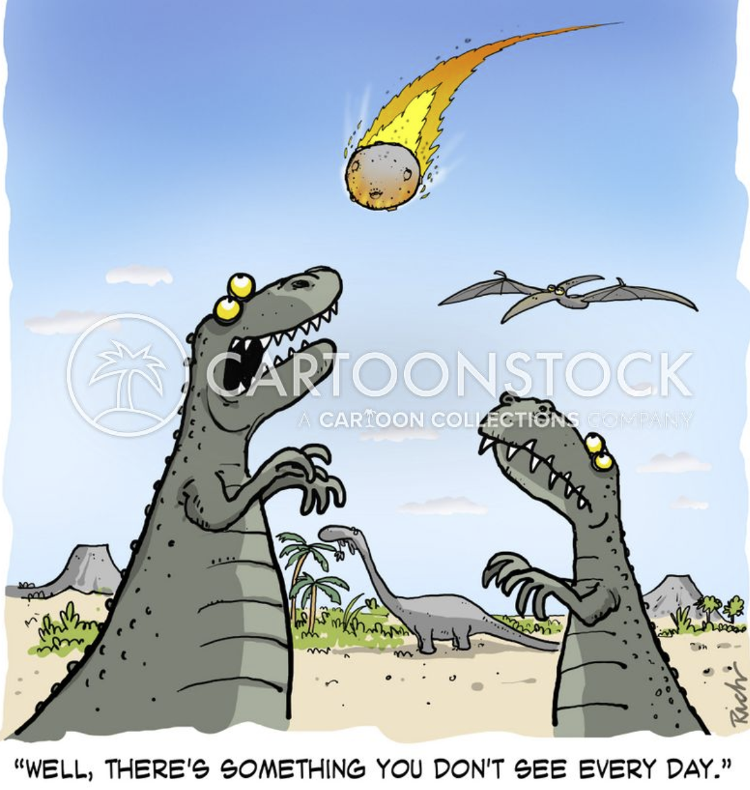
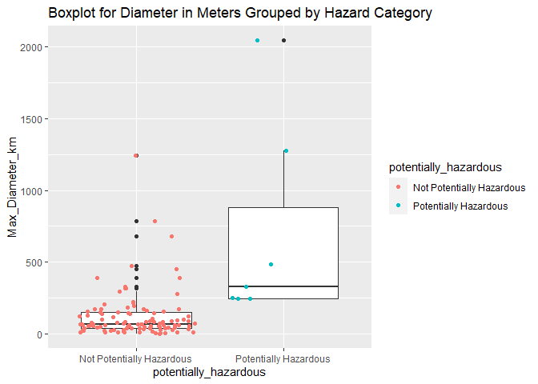
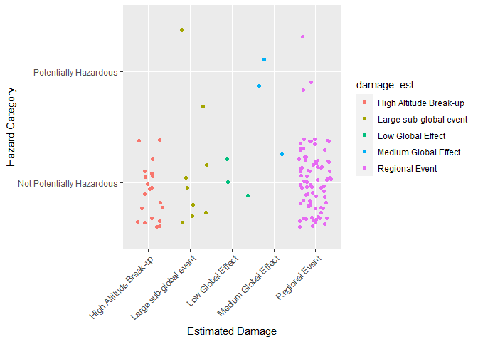
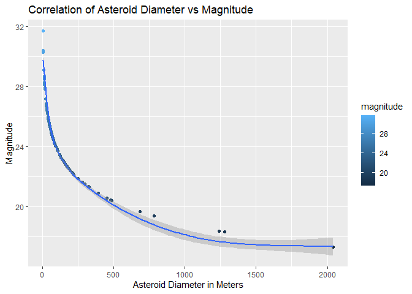
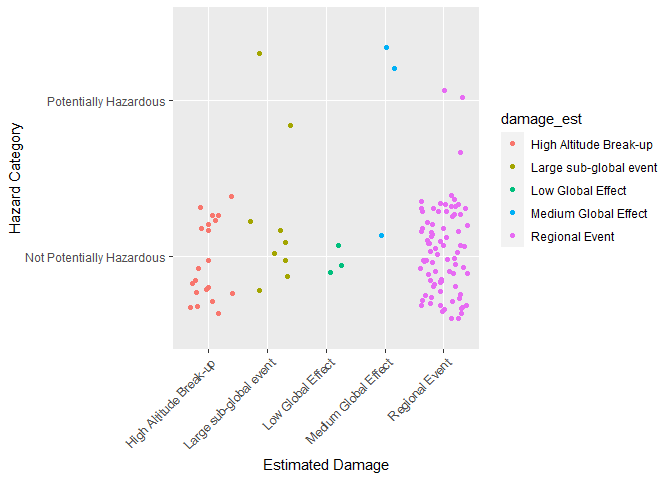
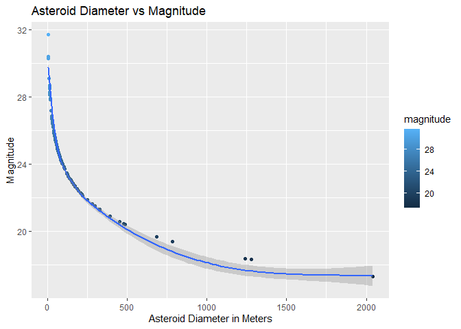

NASA Near Earth Orbit Asteroid Analysis API
================
Dave Bergeron
9/30/2021

# 1 Requirements

List of functions used with NASA NEO API, I used the following packages:

-   `tidyverse`: tons of useful features for data manipulation and
    visualization
-   `jsonlite`: API interaction

In addition to those packages, I used the following packages in the rest
of the document:

-   `httr`: useful tools for Working with URLs and HTTP  
-   `dplyr`: A fast, consistent tool for working with data frame like
    objects, both in memory and out of memory.  
-   `ggplot`: A system for ‘declaratively’ creating graphics, based on
    “The Grammar of Graphics”
-   `purrr`: A complete and consistent functional programming toolkit
    for R
-   `lubriate`: consistent and memorable syntax that makes working with
    dates easy and fun
-   `janitor`: simple functions for examining and cleaning dirty data

# 2 Introduction

This project was super fun, I had no idea what to expect when starting
it, but as I immersed myself in the world of API’s, I became enthralled
with the data I was compiling. I ended up using the NASA Near Earth
Object Web Service. The API i called was very limited in its search
parameters (only three, start date, end date, and API key).
Additionally, the API only allows you to pull seven days per call. All
that being said, it did return a lot of interesting information which I
was able to wrangle into some useful tables and visualizations.

The crux of the analysis speaks to how much damage and asteroid could do
to the earth, and if asterorids are potentially hazardous. All that
being said, based on some of the date ranges are pulled, I think we’ll
be okay.



# 3 Function to contact API and Inspect the Data

The `asteroidcall` function below is used to query the NASA NEO API. As
mentioned above, it only accepts three parameters (start\_date,
end\_date, and api\_key). Given a `demo_key` can be used for the API,
the user only needs to enter the start and end dates of the seven day
period they would like to pull data from.

``` r
asteroidcall <- function(start_date, end_date){GET(url = "https://api.nasa.gov/neo/rest/v1/feed?",
                  query = list(
                    start_date = start_date,
                    end_date = start_date,
                    api_key = "DEMO_KEY",
  str(asteroid, max.level = 1)))
  return(asteroid)
}

asteroidcall("1998-09-27", "1998-10-02")
```

    ## List of 10
    ##  $ url        : chr "https://api.nasa.gov/neo/rest/v1/feed?start_date=2021-08-025&end_date=2021-09-01&api_key=DEMO_KEY"
    ##  $ status_code: int 200
    ##  $ headers    :List of 18
    ##   ..- attr(*, "class")= chr [1:2] "insensitive" "list"
    ##  $ all_headers:List of 1
    ##  $ cookies    :'data.frame': 0 obs. of  7 variables:
    ##  $ content    : raw [1:132935] 7b 22 6c 69 ...
    ##  $ date       : POSIXct[1:1], format:  ...
    ##  $ times      : Named num [1:6] 0.00 4.50e-05 4.70e-05 1.04e-04 1.19e+01 ...
    ##   ..- attr(*, "names")= chr [1:6] "redirect" "namelookup" "connect" "pretransfer" ...
    ##  $ request    :List of 7
    ##   ..- attr(*, "class")= chr "request"
    ##  $ handle     :Class 'curl_handle' <externalptr> 
    ##  - attr(*, "class")= chr "response"

    ## Response [https://api.nasa.gov/neo/rest/v1/feed?start_date=2021-08-025&end_date=2021-09-01&api_key=DEMO_KEY]
    ##   Date: 2021-10-05 00:13
    ##   Status: 200
    ##   Content-Type: application/json;charset=UTF-8
    ##   Size: 133 kB

## 3.1 Converting the data in the API Call to Tibble

It is a fairly laborious process to get the data from the API call into
a usable data frame/tibble. Each day queried returns its own data frame.
This requires all the data frames being combined into one. Luckily the
columns are all the same. Once the `JSON` conversion is complete,
`do.call` is required to combine all the data frames into one. There are
three columns which are not usable or of value so the `subset()`
function was used to remove them. The final step was ordering the
columns into something a bit more user friendly.

``` r
asteroiddata = fromJSON(rawToChar(asteroid$content), flatten = TRUE)
asteroiddata2 <- do.call("rbind", asteroiddata$near_earth_objects)
asteroiddata2 <- subset(asteroiddata2, select = -c(neo_reference_id, links.self, close_approach_data))
asteroiddata2 <- asteroiddata2[ ,c(1,2,5,4,6,7,8,9,10,11,12,13,14,3)]
```

## 3.2 Renaming the Columns

At this point, we have a usable data frame to start cleaning up a bit
more. Some of the column names were a bit long, so the following code
was used to turn them into something a little more readable.

``` r
asteroiddata2 <- as_tibble(plyr::rename(asteroiddata2, c(
  "id" = "Asteroid_ID",
  "name" = "Asteroid_Name", 
  "is_potentially_hazardous_asteroid" = "potentially_hazardous",
  "absolute_magnitude_h" = "magnitude",
  "is_sentry_object" = "sentry_object",
  "estimated_diameter.kilometers.estimated_diameter_min" = "est_diameter_km_min",
  "estimated_diameter.kilometers.estimated_diameter_max" = "est_diameter_km_max",
  "estimated_diameter.meters.estimated_diameter_min" = "est_diameter_meter_min",
  "estimated_diameter.meters.estimated_diameter_max" = "est_diameter_meter_max",
  "estimated_diameter.miles.estimated_diameter_min" = "est_diameter_miles_min",
  "estimated_diameter.miles.estimated_diameter_max" = "est_diameter_miles_max",
  "estimated_diameter.feet.estimated_diameter_min" = "est_diameter_feet_min",
  "estimated_diameter.feet.estimated_diameter_max" = "est_diameter_feet_max")))
```

## 3.3 Adding levels to Two Columns

Two of the columns returned true/false values, so changing those to
names that were easier to understand the context was done in this step.
This enabled a better understanding of the visualizations further down
in the project.

``` r
asteroiddata2$potentially_hazardous <- as.factor(asteroiddata2$potentially_hazardous)
  levels(asteroiddata2$potentially_hazardous) <- c('Not Potentially Hazardous','Potentially Hazardous')
asteroiddata2$sentry_object <- as.factor(asteroiddata2$sentry_object)
  levels(asteroiddata2$sentry_object) <- c('No','Yes')
```

## 3.4 Adding first new variable - `damage est`

A number of the columns in the data frame give information on the
estimated size of the asteroids returned in the API call. I was able to
find some information which provided the level of damage an asteroid
could do to Earth if it were to impact the planet based on its diameter
in meters. The code below created a new categorical variable and applies
the different damage classifications based on the diameter of the
asteroid in meters.

``` r
asteroiddata2 <- asteroiddata2 %>% 
  mutate(damage_est = if_else(asteroiddata2$est_diameter_meter_max < 30, "High Altitude Break-up",
                                                        if_else(asteroiddata2$est_diameter_meter_max <= 300, "Regional Event",
                                                                if_else(asteroiddata2$est_diameter_meter_max <= 600, "Large sub-global event",
                                                                        if_else(asteroiddata2$est_diameter_meter_max <= 1000, "Low Global Effect",
                                                                                if_else(asteroiddata2$est_diameter_meter_max <= 5000, "Medium Global Effect",
                                                                                        if_else(asteroiddata2$est_diameter_meter_max <= 10000, "Large Global Effect", "Extinction Event",)))))))
```

## 3.5 Adding second new variable `diameter range`

A second new variable was added to the data frame. The data provided by
the API gives an estimated maximum diameter in meters and an estimated
minimum in meters. This new variable provides the range between the max
and min estimate, for comparison, and to see how distant some of the
estimations are.

``` r
asteroiddata2 <- as_tibble(asteroiddata2)%>% mutate(diameter_range = asteroiddata2$est_diameter_meter_max - asteroiddata2$est_diameter_meter_min)
```

## 3.6 The final tibble after data wrangling

And here we are, after all the wrangling we end up with a useful tibble
to base our analysis from and work with!

``` r
asteroiddata2
```

    ## # A tibble: 117 x 16
    ##    Asteroid_ID Asteroid_Name
    ##    <chr>       <chr>        
    ##  1 3398088     (2007 YF)    
    ##  2 3703059     (2014 YE15)  
    ##  3 3781268     (2017 QV34)  
    ##  4 54185136    (2021 PF10)  
    ##  5 54186661    (2021 PO26)  
    ##  6 54191249    (2021 QK3)   
    ##  7 54192179    (2021 QK6)   
    ##  8 54192187    (2021 RN1)   
    ##  9 54193341    (2021 RU3)   
    ## 10 54194338    (2021 RL5)   
    ## # ... with 107 more rows, and
    ## #   14 more variables:
    ## #   potentially_hazardous <fct>,
    ## #   magnitude <dbl>,
    ## #   sentry_object <fct>,
    ## #   est_diameter_km_min <dbl>,
    ## #   est_diameter_km_max <dbl>, ...

# 4 Second API Endpoint Call

Given some of the limitations as stated above with the search parameters
I did see if there was another relevant API to query. I did come across
one administered by the Jet Propulsion Laboratory. This one enabled me
to pull a list of asteroids that have been removed from the NASA Sentry
List. The Sentry List identifies all asteroids which pose a somewhat
relevant threat to Earth. There were no parameters to specifically query
for this API, other than to see what asteroids were removed from the
list.

This data was tricky to work with, so I had to `unlist()` and repackage
it into a tibble. Once that was complete, I renamed the column headers
to mirror the tibble from the NEO API call.

``` r
removedsentry <- "https://ssd-api.jpl.nasa.gov/sentry.api?removed=1"
removedsentry <- httr::GET(removedsentry)
removedsentry <- removedsentry %>% 
  httr::content() %>%
  unlist() %>% 
  matrix(ncol = 2, byrow = TRUE) %>%
  as_tibble() %>%
  janitor::row_to_names(row_number = 1)
removedsentry <- as_tibble(plyr::rename(removedsentry, c("2837" = "Asteroid_Name",
  "NASA/JPL Sentry Data API" = "Date_Removed")))
```

# 5 Table join

With the headers from the second API call updated, I was able to join
the tibbles from the first and second API calls using a `left_join()`.
This enabled the addition of a column to see if any of the asteroids in
the tibble were previously on the Senty List and what date they were
removed. This provided a nice addition to data, given the NEO API
already provides a column stating if the asteroid is currently on the
Sentry list. The Tibble below is the final tibble to start conducting
analysis from for the rest of the project.

``` r
asteroiddata3 <- left_join(asteroiddata2, removedsentry, by = "Asteroid_Name")
asteroiddata3
```

    ## # A tibble: 117 x 17
    ##    Asteroid_ID Asteroid_Name
    ##    <chr>       <chr>        
    ##  1 3398088     (2007 YF)    
    ##  2 3703059     (2014 YE15)  
    ##  3 3781268     (2017 QV34)  
    ##  4 54185136    (2021 PF10)  
    ##  5 54186661    (2021 PO26)  
    ##  6 54191249    (2021 QK3)   
    ##  7 54192179    (2021 QK6)   
    ##  8 54192187    (2021 RN1)   
    ##  9 54193341    (2021 RU3)   
    ## 10 54194338    (2021 RL5)   
    ## # ... with 107 more rows, and
    ## #   15 more variables:
    ## #   potentially_hazardous <fct>,
    ## #   magnitude <dbl>,
    ## #   sentry_object <fct>,
    ## #   est_diameter_km_min <dbl>,
    ## #   est_diameter_km_max <dbl>, ...

# 6 Contingeny Tables

## 6.1 Two-way Contingency Table

The two-way contingency table below shows the count of asteroids that
are potentially hazardous vs. no potentially hazardous and the damage
they could inflict if they were to impact the Earth. For this timeframe,
there were two that were potentially hazardous that would have resulted
in a Medium Global event.

``` r
knitr::kable(table(asteroiddata3$damage_est, asteroiddata2$potentially_hazardous),
             caption = paste("Potentially vs Non-Potentially Hazardous Asteroids", "by destruction potetial"))
```

|                        | Not Potentially Hazardous | Potentially Hazardous |
|:-----------------------|--------------------------:|----------------------:|
| High Altitude Break-up |                        20 |                     0 |
| Large sub-global event |                         7 |                     2 |
| Low Global Effect      |                         3 |                     0 |
| Medium Global Effect   |                         1 |                     2 |
| Regional Event         |                        79 |                     3 |

Potentially vs Non-Potentially Hazardous Asteroids by destruction
potetial

## 6.2 Three-Way Contingency Table

The three-way contingency table below takes what was provided above in
the two-way table and further categorizes based on if the asteroids were
on the Sentry list or not. As a reminder, the Sentry list are the
asteroids NASA is keeping a close watch on. Luckily none of them were!

``` r
table(asteroiddata3$damage_est, asteroiddata2$potentially_hazardous, asteroiddata2$sentry_object)
```

    ## , ,  = No
    ## 
    ##                         
    ##                          Not Potentially Hazardous
    ##   High Altitude Break-up                        20
    ##   Large sub-global event                         7
    ##   Low Global Effect                              3
    ##   Medium Global Effect                           1
    ##   Regional Event                                79
    ##                         
    ##                          Potentially Hazardous
    ##   High Altitude Break-up                     0
    ##   Large sub-global event                     2
    ##   Low Global Effect                          0
    ##   Medium Global Effect                       2
    ##   Regional Event                             3
    ## 
    ## , ,  = Yes
    ## 
    ##                         
    ##                          Not Potentially Hazardous
    ##   High Altitude Break-up                         0
    ##   Large sub-global event                         0
    ##   Low Global Effect                              0
    ##   Medium Global Effect                           0
    ##   Regional Event                                 0
    ##                         
    ##                          Potentially Hazardous
    ##   High Altitude Break-up                     0
    ##   Large sub-global event                     0
    ##   Low Global Effect                          0
    ##   Medium Global Effect                       0
    ##   Regional Event                             0

# 7 Summary Statistics

The function below was written to provide summary statistics for the
estimated asteroid diameters in the table. The user can specify if they
want to see summaries for Kilometers, Meters, Miles, or Feet. I made a
few attempts to try and simplify the function parameters, but ultimately
the tibble object and associated column name need to be used for the
function to work properly.

``` r
astsumcall <- function(x){asteroiddata3 %>%
    summarise("Min." = min(x),
              "1st Quartile" = quantile(x, 0.25),
              "Median" = quantile(x, 0.5),
              "Mean" = mean(x),
              "3rd Quartile" = quantile(x, 0.75),
              "Max" = max(x),
              "Std. Dev" = sd(x),
              "IQR" = IQR(x))
  }

asteroidstats <- astsumcall(asteroiddata3$est_diameter_meter_max)

knitr::kable(asteroidstats, 
             caption="Summary Statistics of Estimated Maximum Diameter of Asteroids Observed during the Specified Timeframe",
             digits=2)
```

| Min. | 1st Quartile | Median |   Mean | 3rd Quartile |     Max | Std. Dev |    IQR |
|-----:|-------------:|-------:|-------:|-------------:|--------:|---------:|-------:|
| 2.72 |        43.06 |  72.12 | 161.69 |       164.98 | 2041.93 |   269.48 | 121.93 |

Summary Statistics of Estimated Maximum Diameter of Asteroids Observed
during the Specified Timeframe

# 8 Visualisations

## 8.1 Boxplotes grouped by hazardous, non hazardous

This plot shows the box plots for estimated maximum diameter in meters
and groups them by whether or not the asteroids are hazardous.

``` r
BPH <- ggplot(data = asteroiddata3, aes(x = potentially_hazardous, y = est_diameter_meter_max)) + geom_boxplot() + geom_point(aes(color = potentially_hazardous), position = "jitter") + labs(y = "Max_Diameter_km", title="Boxplot for Diameter in Meters Grouped by Hazard Category") 
BPH
```

<!-- -->

## 8.2 Boxplot size of asteroids grouped by Damage Potential

Another boxplot was created this time grouping the size of the asteroids
by the damage they could inflict if they impacted Earth.

``` r
BPH <- ggplot(data = asteroiddata3, aes(x = damage_est, y = est_diameter_meter_max)) + geom_point(aes(color = damage_est), position = "jitter") + geom_boxplot() + labs(x = "Damage Potential", y = "Max_Diameter_Meters", title="Boxplot for Diameter in Meters Grouped by Damage Potential") + guides(x=guide_axis(angle=45))
BPH
```

<!-- -->

## 8.3 Bar chart showing grouping of damag potetial observed

The bar chart shows the count of asteroids categorized by the damage
they could inflict if they impacted Earth and if they are considered
potentially hazardous.

``` r
BCD <- ggplot(data = asteroiddata3, aes(y = damage_est)) + geom_bar(aes(fill = as.factor(potentially_hazardous)), position = "dodge") + labs(y = "Damage Potential") + scale_fill_discrete(name = "") + guides(y=guide_axis(angle=45))
BCD
```

<!-- -->

## 8.4 Scatterplot Hazard and Damage Potential

The scatter plot shows the clustering of asteroids by whether they are
hazardous and the damage they could inflict if they impacted Earth.

``` r
ASCT <- ggplot(data = asteroiddata3, aes(y = potentially_hazardous, x = damage_est)) + geom_jitter(aes(color = damage_est)) + guides(x=guide_axis(angle=45))
ASCT
```

<!-- -->

## 8.5 Correlation Size and Magnitude

This chart examines the correlation between an asteroids size and its
brightness. NASA and JPL use the term `absolute magnitude` to determine
how bright a celestial object is. The lower the magnitude, the brighter
the object, or put another way, the more luminous an object, the smaller
the numerical value of its magnitude. The chart below shows the larger
an asteroid is, the brighter it is. Looking at some research online,
this makes sense, and probably also explains why other planets in the
solar system look like really bright stars when we can see them in the
sky at night.

``` r
CDRE <- ggplot(data = asteroiddata3, aes(y = magnitude, x = est_diameter_meter_max)) + geom_point(aes(color = magnitude), position = "jitter") + geom_smooth(formula = y ~ x, method = "loess") + labs(x = "Asteroid Diameter in Meters", y = "Magnitude", title="Asteroid Diameter vs Magnitude") 
CDRE
```

<!-- -->
