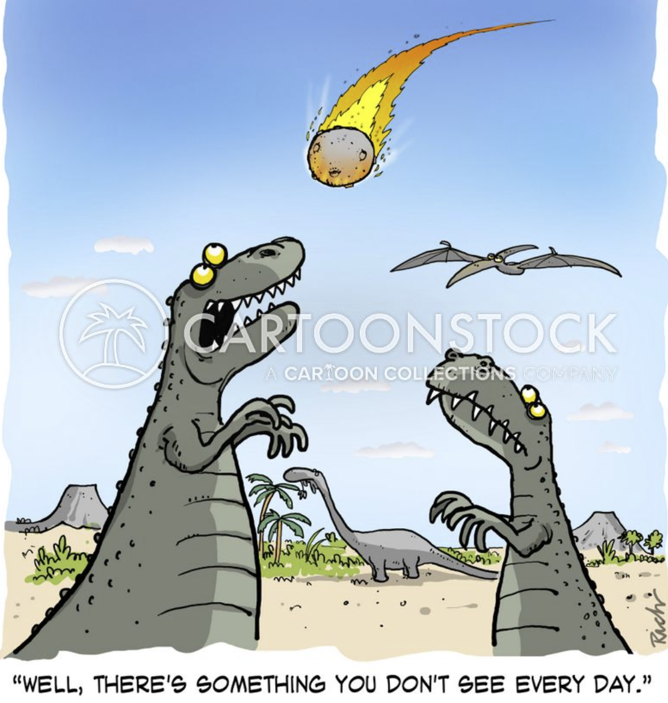

```{r setup, include=FALSE, warning=FALSE, error=FALSE}
knitr::opts_chunk$set(echo = TRUE)
library(tidyverse)
library(rmarkdown)
library(jsonlite)
library(dplyr)
library(plyr)
library(tidyr)
library(rlang)
library(ggplot2)
library(knitr)
library(purrr)
library(haven)
library(RSQLite)
library(parallel)
library(httr)
library(lubridate)
library(janitor)
```

# Requirements

List of functions used with NASA NEO API, I used the following packages:

* `tidyverse`: tons of useful features for data manipulation and visualization
* `jsonlite`: API interaction

In addition to those packages, I used the following packages in the rest of the document:

* `httr`: useful tools for Working with URLs and HTTP  
* `dplyr`:  A fast, consistent tool for working with data frame like objects, both in memory and out of memory.  
* `ggplot`:  A system for 'declaratively' creating graphics, based on "The Grammar of Graphics"
* `purrr`: A complete and consistent functional programming toolkit for R
* `lubriate`: consistent and memorable syntax that makes working with dates easy and fun
* `janitor`: simple functions for examining and cleaning dirty data

# Intro

This project was super fun, I had no idea what to expect when starting it, but as I immeresed myself in the world of API's, I became enthralled with the data I was compliling.  

```{R, echo=FALSE, eval=TRUE}

```

# Functions to contact API and inspect data

The function below is used to query the NASA NEO API.


``` {r}
asteroidcall <- function(start_date, end_date){GET(url = "https://api.nasa.gov/neo/rest/v1/feed?",
                  query = list(
                    start_date = start_date,
                    end_date = start_date,
                    api_key = "DEMO_KEY",
  str(asteroid, max.level = 1)))
  return(asteroid)
}

asteroidcall("1998-09-27", "1998-10-02")
```

# Converting asteroid data in the API Call to Tibble

Taking the asteroid data and compiling it into one dataframe/tibble.  API call retuns one dataframe per date, need to combine into one tibble., adding date column and removing neo_ID, url, and list.  Adding date of observation column

```{r asteroid data, echo=TRUE, eval=TRUE}
asteroiddata = fromJSON(rawToChar(asteroid$content), flatten = TRUE)
asteroiddata2 <- do.call("rbind", asteroiddata$near_earth_objects)
asteroiddata2 <- subset(asteroiddata2, select = -c(neo_reference_id, links.self, close_approach_data))
asteroiddata2 <- asteroiddata2[ ,c(1,2,5,4,6,7,8,9,10,11,12,13,14,3)]
```


# trasformation of asteroid dataset

## rename columns
xxxx

```{r rename columns, r asteroid data, echo=TRUE, eval=TRUE, error=FALSE, message=FALSE}
asteroiddata2 <- as_tibble(plyr::rename(asteroiddata2, c(
  "id" = "Asteroid_ID",
  "name" = "Asteroid_Name", 
  "is_potentially_hazardous_asteroid" = "potentially_hazardous",
  "absolute_magnitude_h" = "magnitude",
  "is_sentry_object" = "sentry_object",
  "estimated_diameter.kilometers.estimated_diameter_min" = "est_diameter_km_min",
  "estimated_diameter.kilometers.estimated_diameter_max" = "est_diameter_km_max",
  "estimated_diameter.meters.estimated_diameter_min" = "est_diameter_meter_min",
  "estimated_diameter.meters.estimated_diameter_max" = "est_diameter_meter_max",
  "estimated_diameter.miles.estimated_diameter_min" = "est_diameter_miles_min",
  "estimated_diameter.miles.estimated_diameter_max" = "est_diameter_miles_max",
  "estimated_diameter.feet.estimated_diameter_min" = "est_diameter_feet_min",
  "estimated_diameter.feet.estimated_diameter_max" = "est_diameter_feet_max")))
```


## adding levels to  the tibble

xxxx

```{r, eval=TRUE, echo=TRUE}
asteroiddata2$potentially_hazardous <- as.factor(asteroiddata2$potentially_hazardous)
  levels(asteroiddata2$potentially_hazardous) <- c('Not Potentially Hazardous','Potentially Hazardous')
asteroiddata2$sentry_object <- as.factor(asteroiddata2$sentry_object)
  levels(asteroiddata2$sentry_object) <- c('No','Yes')
```


## adding new column damage est

create new variable

```{r, eval=TRUE, echo=TRUE}
asteroiddata2 <- asteroiddata2 %>% 
  mutate(damage_est = if_else(asteroiddata2$est_diameter_meter_max < 30, "High Altitude Break-up",
                                                        if_else(asteroiddata2$est_diameter_meter_max <= 300, "Regional Event",
                                                                if_else(asteroiddata2$est_diameter_meter_max <= 600, "Large sub-global event",
                                                                        if_else(asteroiddata2$est_diameter_meter_max <= 1000, "Low Global Effect",
                                                                                if_else(asteroiddata2$est_diameter_meter_max <= 5000, "Medium Global Effect",
                                                                                        if_else(asteroiddata2$est_diameter_meter_max <= 10000, "Large Global Effect", "Extinction Event",)))))))
```

## adding new variable showig range between max a min diameter in meters

xxxx

```{r, eval=TRUE, echo=TRUE}
asteroiddata2 <- as_tibble(asteroiddata2)%>% mutate(diameter_range = asteroiddata2$est_diameter_meter_max - asteroiddata2$est_diameter_meter_min)
```


### tibble after data wrangling

And here we are, after all that wrangling, a readable and useful tibble to work with!

```{r, eval=TRUE, echo=TRUE}
asteroiddata2
```


## 2nd endpoint call

asteroids removed from the sentry list


```{r API call asteroid browse api, echo=TRUE, eval=TRUE, message=FALSE, error=FALSE, warning=FALSE}
removedsentry <- "https://ssd-api.jpl.nasa.gov/sentry.api?removed=1"
removedsentry <- httr::GET(removedsentry)
removedsentry <- removedsentry %>% 
  httr::content() %>%
  unlist() %>% 
  matrix(ncol = 2, byrow = TRUE) %>%
  as_tibble() %>%
  janitor::row_to_names(row_number = 1)
removedsentry <- as_tibble(plyr::rename(removedsentry, c("2836" = "Asteroid_Name",
  "NASA/JPL Sentry Data API" = "Date_Removed")))
```

# table join

This new table now shows is an asteroid may be been previously captured on the NASA Sentry List and combines the tables from the two endpoints above.

```{r, echo=TRUE, eval=TRUE}
asteroiddata3 <- left_join(asteroiddata2, removedsentry, by = "Asteroid_Name")
asteroiddata3
```

# contingeny tables

## two-way contingency tables

says that of the hazardous observed during the seven day timeframe 4 asteroids would result in a low global effect if they impacted earth where 2 would result in a regional event if they impacted earth.

```{r, eval=TRUE, echo=TRUE}
knitr::kable(table(asteroiddata3$damage_est, asteroiddata2$potentially_hazardous),
             caption = paste("Potentially vs Non-Potentially Hazardous Asteroids", "by destruction potetial"))
```


## three way contingency table

None of the observed asteroids on listed on NASA/JPLs Sentry Impact prediction system indicating an impact is likely.

```{r, eval=TRUE, echo=TRUE}
table(asteroiddata3$damage_est, asteroiddata2$potentially_hazardous, asteroiddata2$sentry_object)
```

## summary statistics

xxxxx

```{r summary asteroid2 data, echo=TRUE, eval=TRUE, message=FALSE, error=FALSE, warning=FALSE}
astsumcall <- function(x){asteroiddata3 %>%
    summarise("Min." = min(x),
              "1st Quartile" = quantile(x, 0.25),
              "Median" = quantile(x, 0.5),
              "Mean" = mean(x),
              "3rd Quartile" = quantile(x, 0.75),
              "Max" = max(x),
              "Std. Dev" = sd(x),
              "IQR" = IQR(x))
  }

asteroidstats <- astsumcall(asteroiddata3$est_diameter_meter_max)

knitr::kable(asteroidstats, 
             caption="Summary Statistics of Estimated Maximum Diameter of Asteroids Observed during the Specified Timeframe",
             digits=2)


```

# Visualisations

## Boxplotes grouped by hazardous, non hazardous

```{r , echo=TRUE, eval=TRUE, message=FALSE, error=FALSE, warning=FALSE}
BPH <- ggplot(data = asteroiddata3, aes(x = potentially_hazardous, y = est_diameter_meter_max)) + geom_boxplot() + geom_point(aes(color = potentially_hazardous), position = "jitter") + labs(y = "Max_Diameter_km", title="Boxplot for Size in Meters Grouped by Hazard Rating") 
BPH
```


## Boxplot size of asteroids grouped by hazard status

xxxx

```{r, echo=TRUE, eval=TRUE}
BPH <- ggplot(data = asteroiddata3, aes(x = damage_est, y = est_diameter_meter_max)) + geom_point(aes(color = damage_est), position = "jitter") + geom_boxplot() + labs(x = "Damage Potential", y = "Max_Diameter_Meters", title="Boxplot for Size in Meters Grouped by Damage Potential") + guides(x=guide_axis(angle=45))
BPH
```


## Bar chart showing grouping of damag potetial observed

xxx

```{r, echo=TRUE, eval=TRUE}
BCD <- ggplot(data = asteroiddata3, aes(y = damage_est)) + geom_bar(aes(fill = as.factor(potentially_hazardous)), position = "dodge") + labs(y = "Damage Potential") + scale_fill_discrete(name = "") + guides(y=guide_axis(angle=45))
BCD
```

## visualization

xxxx

```{r, eval=TRUE, echo=TRUE}
BCP <- ggplot(data = asteroiddata3, aes(y = est_diameter_meter_max, x = damage_est)) + geom_count(alpha = .75, color = 'darkblue') + labs(y = "Estimated Diameter in Meters") + guides(x=guide_axis(angle=45))
BCP
```

## scatterplot

xxxx

```{r, echo=TRUE, eval=TRUE}
ASCT <- ggplot(data = asteroiddata3, aes(y = potentially_hazardous, x = damage_est)) + geom_jitter(aes(alpha = .75, color = damage_est)) + labs(y = "Estimated Diameter in Meters") + guides(x=guide_axis(angle=45))
ASCT
```


# correlation

Inverse realationship, as the asteroid gets larger the magnitude gets smaller.  The lower the magnitude the birghter the object.  This suggests the larger an asteroid the brighter it is.  This also shows of the observed asteroids in the timeframe.  The more luminous an object, the smaller the numerical value of its magnitude.

```{r, echo=TRUE, eval=TRUE, warning=FALSE, error=FALSE}
CDRE <- ggplot(data = asteroiddata3, aes(y = magnitude, x = est_diameter_meter_max)) + geom_point(aes(color = magnitude), position = "jitter") + geom_smooth(formula = y ~ x, method = "loess") + labs(x = "Asteroid Diameter in Meters", y = "Magnitude", title="Asteroid Diameter vs Magnitude") 
CDRE
```
